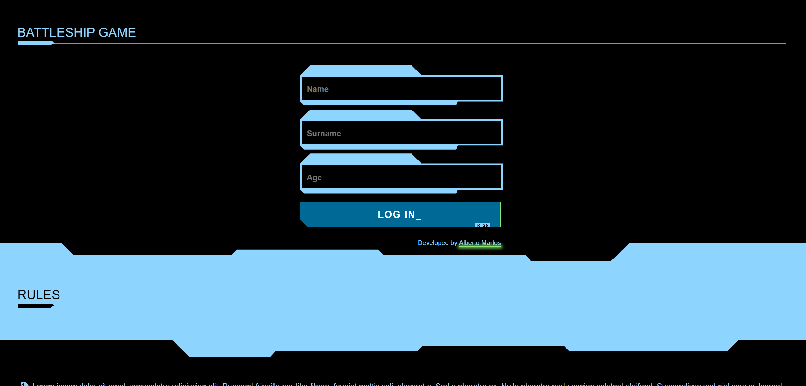
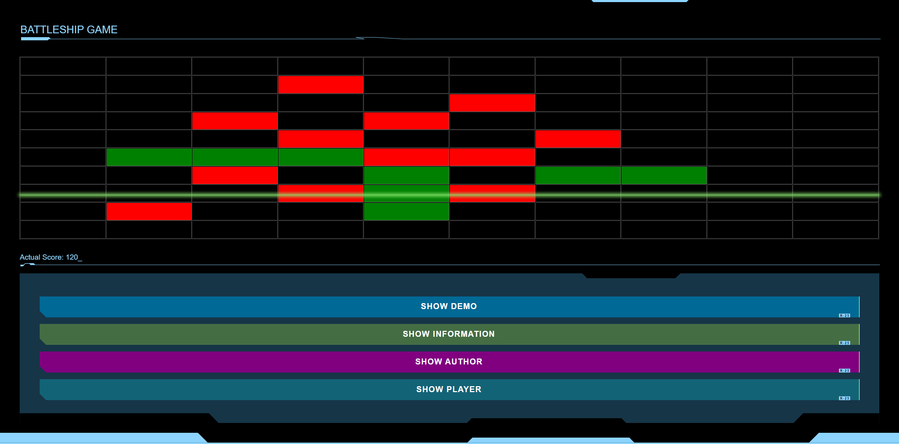

# BATTLESHIP GAME (CyberPunk) V.0.1

Battleship (also known as Battleships or Sea Battle) is a strategy type guessing game for two players. It is played on ruled grids (paper or board) on which each player's fleet of warships are marked. The locations of the fleets are concealed from the other player. Players alternate turns calling "shots" at the other player's ships, and the objective of the game is to destroy the opposing player's fleet.

## Authors

- [@AlbertoMartos](https://www.github.com/albertomartos) -> JavaScript - HTML - CSS

## Demo

You can take a look at the project demo at the images below.

## Deployment

To deploy this project, you need to run it from server. if you want to play with database information, you will have to upload the database.json file to an internal server and 
keep on while playing.

#### Easiest way to deploy:

1. Open Visual Studio Code 
2. install the 'Live Server' extension 
3. Open the BATTLESHIP GAME folder on VSC 
4. Go to View/HTML/index.html
5. Right click on the file and select Open with Live Server

## Screenshots

    

    

## License
MIT License

Copyright (c) [2022] [Alberto Martos]

Permission is hereby granted, free of charge, to any person obtaining a copy
of this software and associated documentation files (the "Software"), to deal
in the Software without restriction, including without limitation the rights
to use, copy, modify, merge, publish, distribute, sublicense, and/or sell
copies of the Software, and to permit persons to whom the Software is
furnished to do so, subject to the following conditions:

The above copyright notice and this permission notice shall be included in all
copies or substantial portions of the Software.

THE SOFTWARE IS PROVIDED "AS IS", WITHOUT WARRANTY OF ANY KIND, EXPRESS OR
IMPLIED, INCLUDING BUT NOT LIMITED TO THE WARRANTIES OF MERCHANTABILITY,
FITNESS FOR A PARTICULAR PURPOSE AND NONINFRINGEMENT. IN NO EVENT SHALL THE
AUTHORS OR COPYRIGHT HOLDERS BE LIABLE FOR ANY CLAIM, DAMAGES OR OTHER
LIABILITY, WHETHER IN AN ACTION OF CONTRACT, TORT OR OTHERWISE, ARISING FROM,
OUT OF OR IN CONNECTION WITH THE SOFTWARE OR THE USE OR OTHER DEALINGS IN THE
SOFTWARE.
